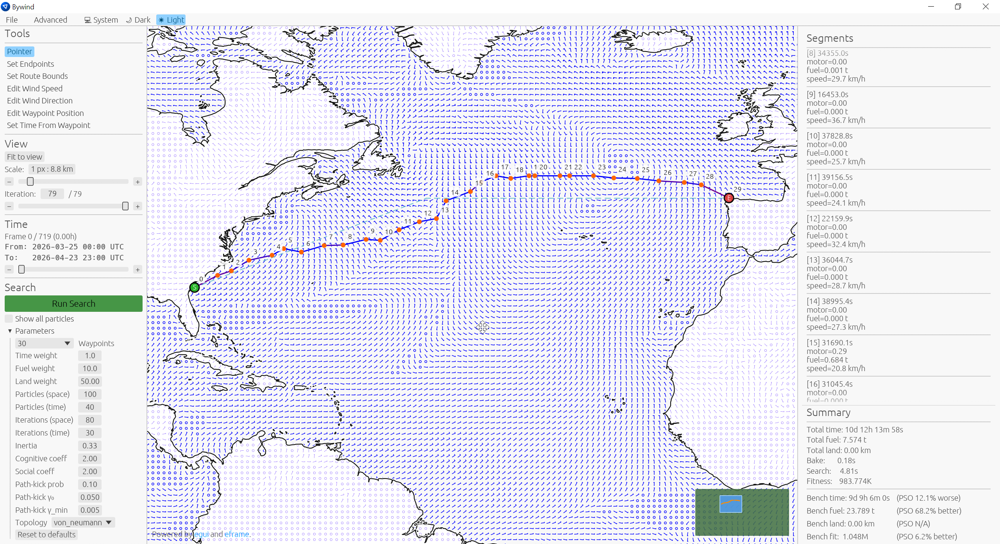

# bywind-viz

egui-based GUI editor and search visualiser for the
[`bywind`](https://crates.io/crates/bywind) sailing-route optimiser.



## Install

```sh
cargo install bywind-viz
```

This installs a single binary, `bywind-viz`. Launch with no arguments
to bring up the editor; persistent state (last loaded map, view
position, panel widths) is restored across launches via eframe's
serde persistence.

## What you can do in it

- **Load wind maps** from GRIB2 (with stride / bbox controls reviewed
  in a modal before loading) or from `wind_codec` binary cache files.
- **Generate synthetic wind maps** at a configurable spatial /
  temporal density, useful for sandbox PSO runs without real data.
- **Edit samples** with brush-style tools: paint absolute speed,
  paint direction, or interactively drag endpoint waypoints.
- **Set up a search** by picking start / end waypoints, drawing an
  optional bbox, configuring the boat and search panels.
- **Run a search in the background** while you can still pan, zoom,
  and inspect the evolution of the swarm. Each iteration's gbest is
  drawn over the wind field; segment-table tooltips show per-leg
  fuel / time / speed / land-distance.
- **Time-reopt on drag.** Edit a waypoint of the displayed gbest with
  the mouse; the time-only PSO re-runs in the background to find new
  arrival times for the dragged xy, holding all positions fixed.
- **Save / load scenarios** as TOML files compatible with
  `bywind-cli`'s `--config` flag, so a configuration tuned in the GUI
  can drive a headless batch run unchanged.

## License

Dual-licensed under either of

- Apache License, Version 2.0 ([`LICENSE-APACHE`](./LICENSE-APACHE))
- MIT license ([`LICENSE-MIT`](./LICENSE-MIT))

at your option.
